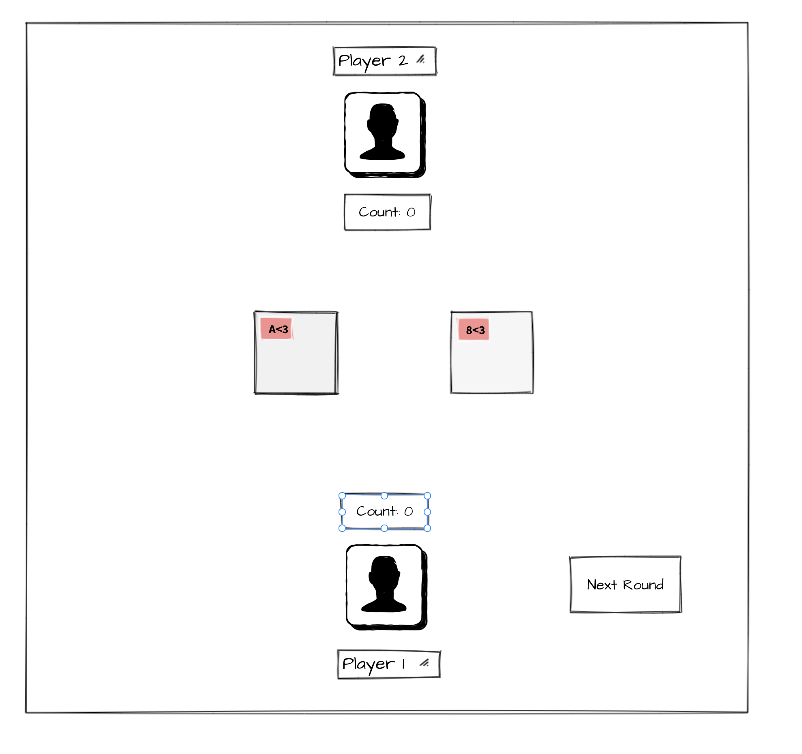
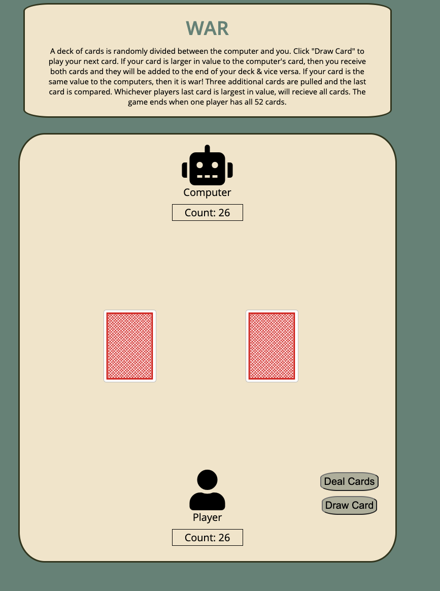
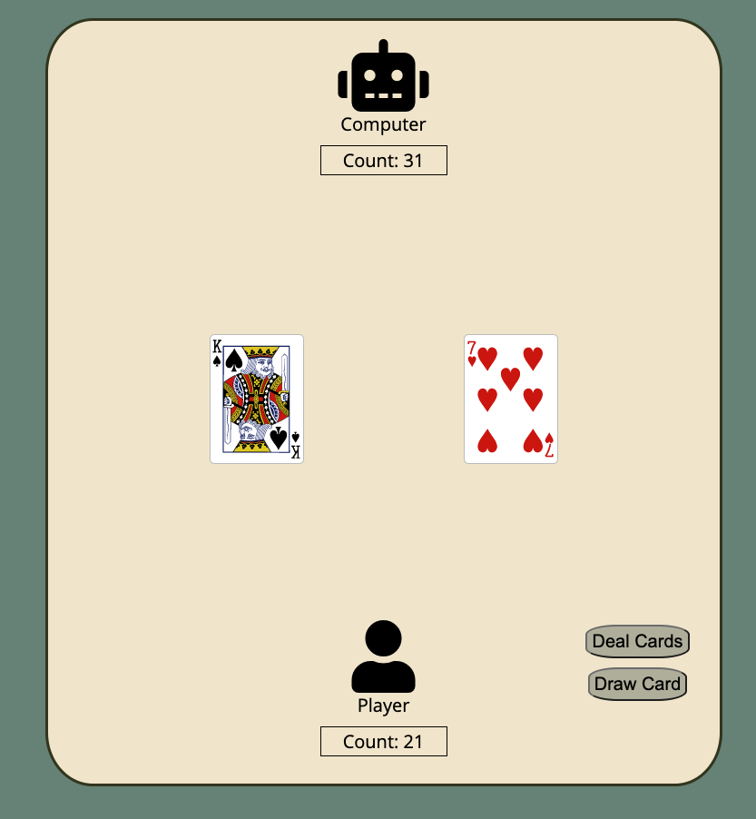

# War Card Game

## About the game

A deck of cards is generated. Two decks are randomly shuffled between the computer and yourself. You play rounds by placing the top card of your deck in the middle. Whichever players card is greater in value will get both of the cards. If the two flipped cards are the same value, there will be a war. The next three cards are generated and the final card is compared. Whoever wins the war will get all 8 cards to add to their deck. Play rounds until one player has all the cards and is declared the winner. 

 
 
 

This is a simple card game that is created with HTML, CSS, and JavaScript.

## Getting Started

To start the game click the "Deal Cards" button. From there you will click "Next" to draw each round. The game will end when one player has all 52 cards. 
This game can be played at https://beccaawhite.github.io/Project-1/

## Next Steps

Beyond the simple functionality of the game, there are features I would like to add with more time. Starting out, I would like to add a prompt for the player to enter their name and for it to relect on the screen. After the game is finished, I would also like to add a reset button where the player is welcome to continue playing as many rounds as they would like and the board would track how many wins or losses they have. I would also like to add more customizable features with the theme. After entering the players name, they would then be prompted to choose a theme to their liking that would refect in the cards and the board itself.

